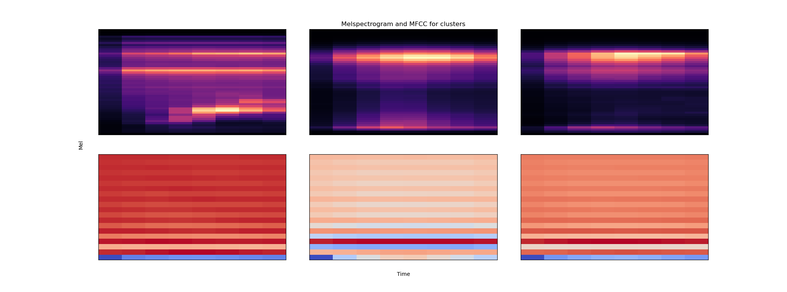
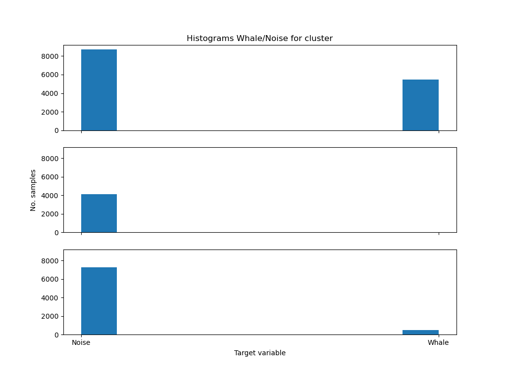

# HierarchicalClusteringAudio
The notebook contains the implementation of Hierarchical Clustering in order to group the audio tracks of North Atlantic whales provided into a 
given number of cluster. The criteria used is the extraction of Mel Frequency Cepstral Coefficients because they 
represent in a compact way the overall features of the data. The number of cluster is set to 3, this number was 
choosen by looking at the dendrogram representation.

## Data description
The data consists of 30000 training samples and each candidate is a 2-second .aiff sound clip with a sample rate of 2 kHz. The file "train.csv" gives the labels for the train set.
Candidates that contain a right whale call have label=1, otherwise label=0.

## Implementation details
In order to aggregate the recordings in the clusters the MFCC feature is computed for each audio object and stored in a list.
The list is averaged on the second dimension in order to be fed to the AgglomerativeClustering method.
The computation of the MFCC over the 30000 samples is not really fast, so it has been carried on through batch processing 
on a High Performance Computing Cluster. The output is stored as .csv file inside the resources folder.

The file is loaded in memory as a Pandas dataframe and the results shows that there is a high percentage of right whale calls 
inside the first cluster (visible in the histogram) and also there is a sign in the lower frequencies of the mel-spectrogram 
related to the samples belonging to the first cluster.

## Reference 
https://www.kaggle.com/competitions/whale-detection-challenge/overview
